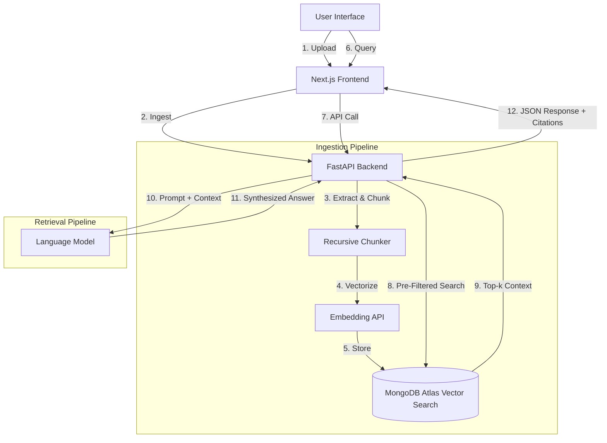

# Readify System Architecture

Readify is built on a high-performance RAG (Retrieval-Augmented Generation) stack designed for speed, accuracy, and enterprise-grade session isolation.

## 🏁 High-Level Workflow

## 🏗️ Technical Component Details

### 1. Frontend: The Interaction Layer
- **Stack**: Next.js 14, Tailwind CSS, Lucide.
- **State Engine**: Manages files, session IDs, and chat history.
- **Animations**: Uses Framer Motion for premium transitions between the landing page and the workspace.
- **Security**: Implements `beforeunload` signals and `keepalive` fetches for automatic session cleanup.

### 2. Backend: The Orchestration Layer
- **Stack**: FastAPI, LangChain, Motor/PyMongo.
- **Multi-File Processing**: Uses `asyncio.gather` for parallel document ingestion.
- **Resilience**: Implements retry patterns for AI provider calls.
- **Session ID Management**: Generates and propagates unique session identifiers to ensure strict data silos.

### 3. Intelligence: Advanced Language Models
- **LLM**: Utilizes high-performance models for reasoning and fast response times.
- **Embeddings**: Employs high-dimensional vectors for precise semantic representation.
- **Reasoning**: Configured with a Zero-Temperature setting to ensure factual consistency and minimize hallucinations.

### 4. Storage: MongoDB Atlas Vector Search
- **Vector Search**: Performs ultra-fast k-NN (k-Nearest Neighbor) searches.
- **Pre-Filtering**: Utilizes metadata filters for `session_id` and `source` to restrict search results at the engine level before computation begins.
- **Scalability**: Capable of scaling from small document sets to millions of vectors.

## 🔒 Data Isolation & Lifecycle
1. **Isolation**: Every chunk in MongoDB is tagged with a `session_id`.
2. **Access Control**: Queries are strictly restricted to the caller's `session_id`.
3. **Purge**: Document vectors are automatically deleted upon session reset or browser close.

---
*Readify: Combining modern AI with robust engineering.*
