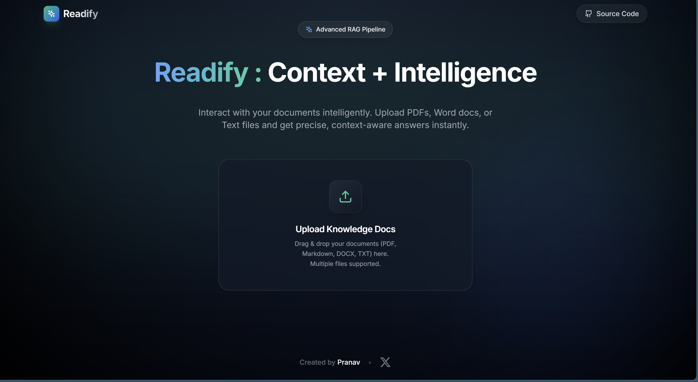

# Readify - Document Intelligence Assistant

Readify is a premium RAG (Retrieval-Augmented Generation) pipeline designed for intelligent, context-aware document exploration. It enables users to upload multiple document formats and engage in deep, citation-backed conversations with their data.



## ✨ Premium Features

- **Multi-Format Mastery**: Support for PDF, DOCX, TXT, and Markdown.
- **Advanced RAG Engine**: Optimized dual-stage retrieval with **MongoDB Atlas Vector Search**.
- **Real-time Vectorization**: Parallel processing for fast ingestion of large documents.
- **Strict Session Isolation**: Data remains private and isolated per session.
- **Verifiable Citations**: Every answer includes precise source and page referencing.
- **Sleek UX**: Modern dark-themed interface with smooth Framer Motion transitions.

## 📺 Product Preview


---

## 🏗️ System Architecture

Readify uses a modular architecture that separates the ingestion pipeline from the query pipeline to ensure maximum performance and accuracy.


*For a deep dive into the technical details, read the [Full Architecture Guide](ARCHITECTURE.md) and [Technical Strategy](TECHNICAL_STRATEGY.md).*

---

## 🛠️ Technology Stack

| Layer | Technology |
| :--- | :--- |
| **Frontend** | Next.js 14, Tailwind CSS, Framer Motion, Lucide Icons |
| **Backend** | FastAPI, LangChain, PyMongo |
| **Database** | MongoDB Atlas (Vector Search & Metadata Filtering) |
| **Models** | OpenAI GPT-4o & Text-Embedding-3-Small |

---

## 🚀 Getting Started

### 1. Prerequisites
- Node.js 18+
- Python 3.10+
- MongoDB Atlas Cluster

### 2. Setup & Installation
```bash
# Clone the repository
git clone https://github.com/pranavsinghpatil/Readify.git
cd Readify

# Install Backend Dependencies
pip install -r backend/requirements.txt

# Install Frontend Dependencies
cd frontend && npm install && cd ..
```

### 3. Environment Configuration
Create a `.env` file in the `backend/` directory based on `.env.example`:
```env
OPENAI_API_KEY=sk-proj-your_openai_key_here
MONGODB_URI=your_mongodb_atlas_uri
DB_NAME=readify_db
COLLECTION_NAME=documents
```

### 4. MongoDB Atlas Search Index
Configure an Atlas Search Index named `vector_index` on your collection with this JSON:
```json
{
  "fields": [
    { "type": "vector", "path": "embedding", "numDimensions": 1536, "similarity": "cosine" },
    { "type": "filter", "path": "session_id" },
    { "type": "filter", "path": "source" }
  ]
}
```

### 5. Launch
Simply run the included batch file to start both servers:
```powershell
.\launch.bat
```

---

## 📄 Documentation & Media

- [Architecture Guide](ARCHITECTURE.md) - Deep dive into system design.
- [Technical Strategy](TECHNICAL_STRATEGY.md) - RAG optimizations and technical decisions.
- [🎬 Product Demo Video](docs-media/Readify_demo%20-%20Made%20with%20Clipchamp.mp4) - Watch the app in action.
- [⚙️ Architecture Walkthrough](docs-media/Readify_arch%20-%20Made%20with%20Clipchamp.mp4) - Technical video overview.

---
Created by **Pranav Patil**. 🚀
