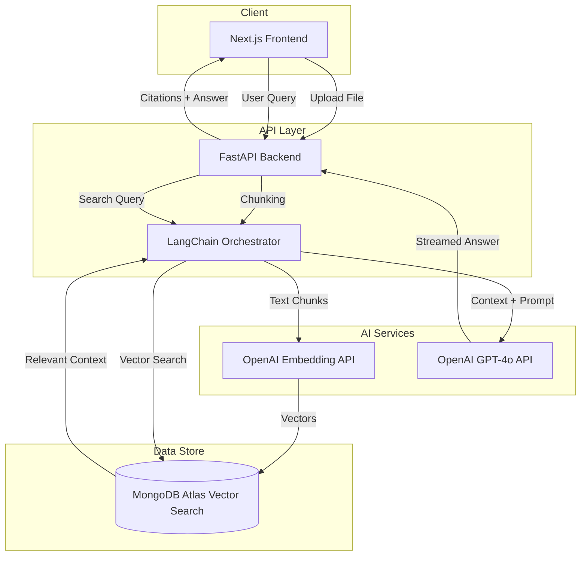

# Readify Architecture

Readify is built on a modern, scalable RAG (Retrieval-Augmented Generation) stack. The system is designed to provide high-performance document intelligence with strict session isolation and verifiable citations.

## System Overview

## Key Components

### 1. Frontend (Next.js 14)
- **React-based UI**: Utilizes Tailwind CSS for a dark-themed, premium interface.
- **Client-Side Storage**: Manages session-specific states to ensure users only interact with their own documents.
- **Real-time Feedback**: Dynamic status updates during the multi-file upload and indexing process.

### 2. Backend (FastAPI)
- **Asynchronous Processing**: Handles file uploads and AI requests concurrently to minimize latency.
- **LangChain Integration**: Acts as the orchestrator for the RAG pipeline, managing the flow between the vector store and the LLM.
- **Provider Agnostic**: While primarily configured for **OpenAI**, the backend uses a modular provider pattern for easy switching.

### 3. Vector Database (MongoDB Atlas)
- **High-Dimensional Storage**: Stores document embeddings generated by OpenAI's `text-embedding-3-small` model.
- **Hybrid Metadata**: Stores filename, page numbers, and session IDs to enable strict filtering and accurate citations.

### 4. AI Logic (OpenAI)
- **Embeddings**: Converts raw text into 1536-dimensional vectors.
- **LLM (GPT-4o)**: Generates human-like, context-aware responses based strictly on the retrieved document segments.

## Pipeline Details

### Ingestion Pipeline
1. **Extraction**: Text is extracted from PDF, DOCX, TXT, or Markdown.
2. **Chunking**: `RecursiveCharacterTextSplitter` creates segments of ~3000 characters with 200-character overlap to preserve context.
3. **Embedding**: Each chunk is transformed into a vector via OpenAI.
4. **Storage**: Vectors and metadata are indexed in MongoDB Atlas.

### Retrieval Pipeline
1. **Similarity Search**: User queries are converted to vectors and matched against the database.
2. **Context Enrichment**: The top **5** most relevant segments (with metadata) are fetched.
3. **Prompt Injection**: The context is injected into a specialized dynamic prompt for the LLM.
4. **Validation**: The system ensures citations are present for every factual claim made in the response.
